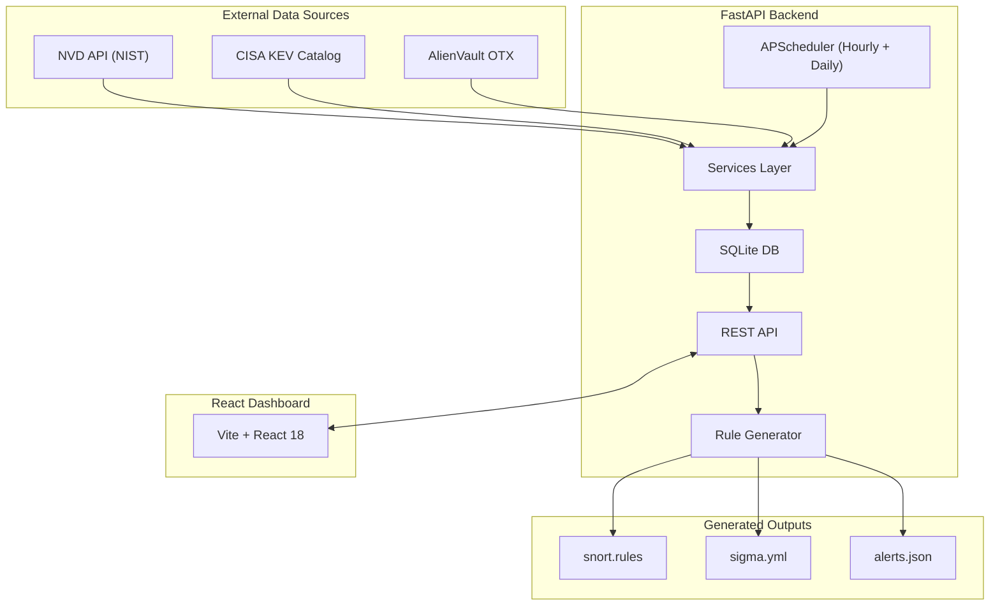

<div align="center">


<p align="center">
  <strong>A self-hosted threat intelligence platform — aggregate CVEs, manage assets, and auto-generate detection rules. Fully local. Zero cloud dependency.</strong>
</p>

<p align="center">
  <a href="https://www.python.org/"></a>
  <a href="https://fastapi.tiangolo.com/"></a>
  <a href="https://react.dev/"></a>
  <a href="https://www.sqlite.org/"></a>

</p>

<p align="center">
  <a href="#-quick-start">Quick Start</a> •
  <a href="#-features">Features</a> •
  <a href="#%EF%B8%8F-architecture">Architecture</a> •
  <a href="#-api-reference">API Reference</a> •
  <a href="#-data-sources">Data Sources</a>
</p>

</div>

---

## ⚡ Quick Start

> [!IMPORTANT]
> Make sure Python 3.11+ and Node.js 18+ are installed, and your `.env` is configured before running.

```powershell
# 1. Clone and enter the project
cd D:\sideproject\vulnerability-tracker

# 2. Set up the backend
python -m venv venv
.\venv\Scripts\pip install -r requirements.txt

# 3. Set up the frontend
cd frontend && npm install && cd ..

# 4. Start both servers (two separate terminals)
.\venv\Scripts\python -m uvicorn backend.app.main:app --reload --host 0.0.0.0 --port 8000
# (new terminal) cd frontend && npm run dev
```

| 🖥️ Dashboard | ⚡ REST API | 📖 Swagger UI |
|:---:|:---:|:---:|
| [localhost:5173](http://localhost:5173) | [localhost:8000](http://localhost:8000) | [localhost:8000/docs](http://localhost:8000/docs) |

---

## ✨ Features

<table>
  <tr>
    <td>📡</td>
    <td><strong>Multi-source Aggregation</strong></td>
    <td>Automatically pulls from NVD, CISA KEV, and AlienVault OTX on a schedule</td>
  </tr>
  <tr>
    <td>🗄️</td>
    <td><strong>Fully Local Storage</strong></td>
    <td>CVEs, IoCs, fetch logs, and assets stored in a zero-config local SQLite database</td>
  </tr>
  <tr>
    <td>🔁</td>
    <td><strong>Automated Scheduled Syncs</strong></td>
    <td>Daily full sync at 02:00 UTC + hourly incremental sync — hands-free</td>
  </tr>
  <tr>
    <td>🧠</td>
    <td><strong>Asset Intelligence</strong></td>
    <td>Map assets to CPE strings; auto-discover all CVEs that match your environment</td>
  </tr>
  <tr>
    <td>📜</td>
    <td><strong>One-click Rule Generation</strong></td>
    <td>Export Snort/Suricata, Sigma SIEM, and JSON alert rules directly from the dashboard</td>
  </tr>
  <tr>
    <td>🔐</td>
    <td><strong>Auth-Protected API</strong></td>
    <td>HTTP Basic auth guards all sensitive routes via environment variables</td>
  </tr>
  <tr>
    <td>🛡️</td>
    <td><strong>Automated Obfuscation</strong></td>
    <td>Built-in security layer that automatically encodes plain-text API keys in .env on startup</td>
  </tr>
  <tr>
    <td>📊</td>
    <td><strong>React Dashboard</strong></td>
    <td>CVE browsing, severity charts, asset tracking, rule exports — all in one UI</td>
  </tr>
</table>

---

## 🏗️ Architecture



---

## 🧰 Tech Stack

<div align="center">

| Layer | Technology |
|:---:|:---|
| **Backend** | Python 3.11 · FastAPI · SQLModel · APScheduler · httpx |
| **Frontend** | React 18 · Vite · Chart.js · Axios |
| **Database** | SQLite — local, zero-config, no server needed |
| **Auth** | HTTP Basic auth — credentials from `.env` |
| **Rule Formats** | Snort / Suricata · Sigma YAML · JSON Alerts |

</div>

---

## 📁 Project Structure

```
vulnforge/  (vulnerability-tracker/)
│
├── backend/
│   └── app/
│       ├── routers/        ← API routes: CVEs, assets, fetch jobs, rules
│       ├── services/       ← Source integrations: NVD, CISA KEV, OTX
│       ├── main.py         ← FastAPI app entry point
│       └── scheduler.py    ← Background sync job definitions
│
├── frontend/
│   └── src/                ← React 18 application source
│
├── scripts/                ← Maintenance & utility scripts
├── output_rules/           ← 📜 Generated: snort.rules · sigma.yml · alerts.json
├── public/                 ← Static frontend assets
├── requirements.txt        ← Python dependencies
└── .env                    ← 🔒 Local config (not committed)
```

---

## 🔑 Environment Setup

To get started, create a `.env` file in the project root (you can use `.env.example` as a template) and add your plain-text API keys. 

> [!TIP]
> **Automatic Obfuscation**: The project features a built-in security layer. The first time you start the backend, it will automatically detect any plain-text keys in your `.env` file and encode them to Base64 (prefixed with `b64:`) to prevent accidental "over-the-shoulder" exposure.

### Obtaining API Keys

| Source | How to Get a Key | Benefit |
|:---:|---|---|
| **NVD (NIST)** | [Request at nvd.nist.gov](https://nvd.nist.gov/developers/request-an-api-key) | Increases rate limits (50 req/30s vs 5 req/30s) |
| **AlienVault OTX** | [Sign up at otx.alienvault.com](https://otx.alienvault.com/) | **Required** for IoC enrichment and threat intelligence pulse data |

---

## 🛠️ Installation

<details>
<summary><strong>🐍 Backend Setup</strong></summary>
<br>

```powershell
cd D:\sideproject\vulnerability-tracker
python -m venv venv
.\venv\Scripts\pip install -r requirements.txt
```

</details>

<details>
<summary><strong>⚛️ Frontend Setup</strong></summary>
<br>

```powershell
cd D:\sideproject\vulnerability-tracker\frontend
npm install
```

</details>

---

## ▶️ Running Locally

**Terminal 1 — Backend API**

```powershell
cd D:\sideproject\vulnerability-tracker
.\venv\Scripts\python -m uvicorn backend.app.main:app --reload --host 0.0.0.0 --port 8000
```

**Terminal 2 — Frontend Dev Server**

```powershell
cd D:\sideproject\vulnerability-tracker\frontend
npm run dev
```

Log in with the `BASIC_AUTH_USERNAME` / `BASIC_AUTH_PASSWORD` values from your `.env`.

---

## ⏰ Scheduled Jobs

The scheduler starts **automatically** with the FastAPI app. No extra setup needed.

| 🕐 Job | ⏱️ Schedule | 📋 Description |
|---|---|---|
| **Full Sync** | Daily at `02:00 UTC` | Complete fetch from NVD, CISA KEV, and OTX |
| **Incremental Sync** | Every hour `(:00)` | Pulls only recent changes since last run |

---

## 🔌 API Reference

> [!NOTE]
> All routes except `GET /` require **HTTP Basic auth**.

<details>
<summary><strong>🩺 Health &amp; Auth</strong></summary>
<br>

| Method | Endpoint | Description |
|---|---|---|
| `GET` | `/` | Service health check |
| `GET` | `/auth/verify` | Validate credentials |

</details>

<details>
<summary><strong>🐛 CVEs</strong></summary>
<br>

| Method | Endpoint | Description |
|---|---|---|
| `GET` | `/cves/` | List CVEs with filtering & pagination |
| `GET` | `/cves/stats` | Dashboard summary statistics |
| `GET` | `/cves/{cve_id}` | CVE detail view with associated IoCs |

</details>

<details>
<summary><strong>🔄 Fetch Jobs</strong></summary>
<br>

| Method | Endpoint | Description |
|---|---|---|
| `GET` | `/fetch/all` | Trigger a full sync from all sources |
| `GET` | `/fetch/nvd` | Trigger NVD fetch only |
| `GET` | `/fetch/cisa-kev` | Sync the CISA KEV catalog |
| `GET` | `/fetch/otx` | Fetch OTX data for recent CVEs |
| `GET` | `/fetch/status` | Inspect last fetch status per source |

</details>

<details>
<summary><strong>🖥️ Assets</strong></summary>
<br>

| Method | Endpoint | Description |
|---|---|---|
| `GET` | `/assets/` | List all tracked assets |
| `POST` | `/assets/` | Add a new asset |
| `GET` | `/assets/{asset_id}` | Get a single asset |
| `DELETE` | `/assets/{asset_id}` | Remove an asset |
| `GET` | `/assets/{asset_id}/cves` | Find CVEs matching the asset's CPE |

</details>

<details>
<summary><strong>📜 Detection Rules</strong></summary>
<br>

| Method | Endpoint | Description |
|---|---|---|
| `GET` | `/rules/snort` | Generate or return Snort/Suricata rules |
| `GET` | `/rules/snort/download` | Download `snort.rules` |
| `GET` | `/rules/sigma` | Generate or return Sigma rules |
| `GET` | `/rules/sigma/download` | Download `sigma.yml` |
| `GET` | `/rules/json` | Generate or return JSON alert payloads |
| `GET` | `/rules/json/download` | Download `alerts.json` |

</details>

---

## 📤 Generated Outputs

All rule files are written to `output_rules/` relative to where the backend process starts:

```
output_rules/
├── snort.rules     # Snort / Suricata network IDS rules
├── sigma.yml       # Sigma SIEM detection rules
└── alerts.json     # Structured JSON alert payloads
```

---

## 🌐 Data Sources

<div align="center">

| Source | What It Provides | Link |
|:---:|---|:---:|
|  | National Vulnerability Database — full CVE catalog with CVSS scores | [Visit →](https://nvd.nist.gov/developers/vulnerabilities) |
|  | Known Exploited Vulnerabilities Catalog — actively exploited CVEs | [Visit →](https://www.cisa.gov/known-exploited-vulnerabilities-catalog) |
|  | Open Threat Exchange — IoC enrichment from the community | [Visit →](https://otx.alienvault.com/) |

</div>

---

## 🧪 Utility Scripts

The `scripts/` directory contains maintenance tools for manual syncing, diagnostics, data inspection, and CPE string correction. **Not required** to run the main app — useful for day-to-day maintenance.

---

## ⚙️ Prerequisites

| Requirement | Version |
|---|---|
| Python | `3.11+` |
| Node.js | `18+` |
| npm | bundled with Node.js |
| NVD API Key | optional but strongly recommended |
| OTX API Key | required for IoC enrichment |

---

<div align="center">

---

**VulnForge — built for blue teamers who believe their threat data belongs to them.**

*No telemetry. No SaaS. No subscriptions. Just your data, your rules, your machine.*

[](https://fastapi.tiangolo.com)
[](https://react.dev)

</div>
